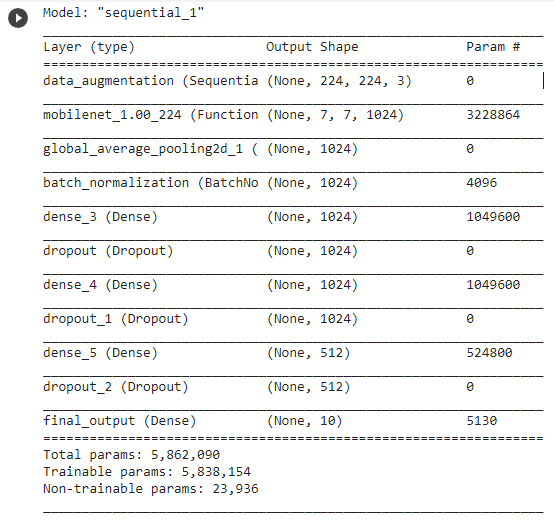

# One-Piece-Image-Classifier

A quick image classifier trained with manually selected One Piece images. 
> 97.80% validation accuracy

> **Deployed on my personal Docker Hub repository: *Click here* [Click here](https://hub.docker.com/repository/docker/ibrahimserouis/my-tensorflow-models)

> **Kaggle Notebook link:  [Kaggle notebook](https://www.kaggle.com/ibrahimserouis99/one-piece-image-classifier-notebook)

## Training 

A fine-tuned mobilenet has been used. The training session has been runned on Google Colab with a GPU execution type. 

## Notebook 

> Notebook link : [Click here](one-piece-image-classifier-notebook.ipynb)

## Model description

- A data augmentation layer which creates "modified" images of the training set
- A MobileNet layer which detects the features
- A Global average pooling layer which converts the feature vectors into a 1280 element vector
- 1*3 Dense layers followed by a dropout layer
- An activation layer (sigmoid) which represents the final output: Probability of input(X) belonging to each class
- Output classes (probabilities) : ['Ace', 'Akainu', 'Brook', 'Chopper', 'Crocodile', 'Franky', 'Jinbei', 'Law', 'Luffy', 'Nami', 'Robin', 'Sanji', 'Shanks', 'Usopp', 'Zoro']

## Architecture

> **Best valdiation accuracy: 97.80%.**

## Results

## How to use 

### 1-First option: Using the Tensorflow Serving image deployed [here](https://hub.docker.com/repository/docker/ibrahimserouis/my-tensorflow-models) **TAG: OP_serving**

Pull the Docker imae with the OP_serving tag, then run inferences using the 8501 port. Tightly respect the model input architecture (batch_size, 224, 224, 3). 

> A test script example is available [here](/Scripts/Prediction_OP_Model_Test.py)

### 2-Second option: Google Colab

#### Step 1:  Run all the cells, then upload the files on which you want to make an inference by clicking on the upload button 

#### Step 2: Slide to the prediction results. You will get two messages displayed as shown in the following screenshots: 

> **Represents the probability of the character belonging to each class. These probabilities are mutually non-exclusive, since there can be more than one character within an image**

## Prerequisites

- Python 3.x or higher 
- IDE: Jupyter Lab/Kaggle Notebooks/Google Colab 
- Frameworks: Tensorflow 2.0 or higher, Keras
