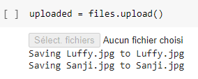
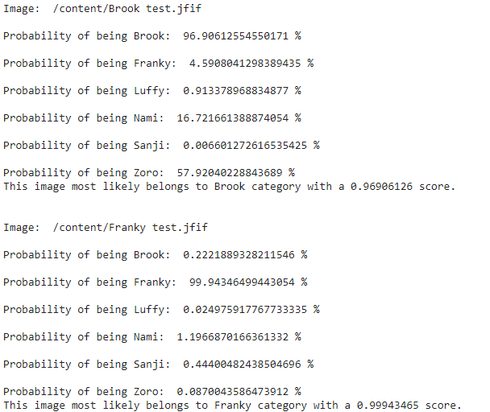
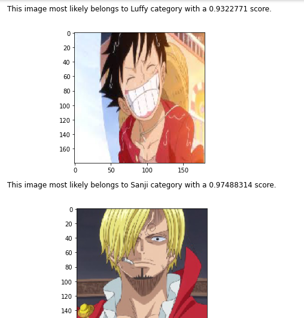

# One-Piece-Image-Classifier

A quick image classifier trained with manually selected One Piece images. 

## Training 

The model was trained using Keras Tuner for finding the best training hyperparameters (learning rate and number of units in the flatten layer). No pre-trained model has been used. The training session has been runned on Google Colab with a GPU execution type. 

## Model description

- 3 Convolutional layers followed by a batch normalization layer, then a MaxPooling layer followed by a batch normalization layer
- A flatten layer
- A dense layer which number of units will be decided by the hyper parameters
- An activation layer (sigmoid) which represents the final output: Probability of input(X) belonging to each class
> **Based on Sergey Ioffe and Christian Szegedy "Batch Normalization: Accelerating Deep Network Training by Reducing Internal Covariate Shift" research paper, there is no need to add a dropout layer since we've used a batch normalization layer.**

> **The number of units within the Dense Layer has been obtained thanks to Keras fine tuning. Out of all the previously used method, this one has generated the best valdiation accuracy: 92.97%.**

## How to use 

### 1-First option: Google Colab

#### Step 1:  Run all the cells, then upload the files on which you want to make an inference by clicking on the upload button 

#### Step 2: Slide to the prediction results. You will get two messages displayed as shown in the following screenshots: 

> **Represents the probability of the character belonging to each class. These probabilities are mutually non-exclusive, since there can be more than one character within an image**

### 2-Second option: Through the test script

#### Navigate to the "image path" variable, and replace it with whatever file you want to perform the prediction/inference onto.
. 

> **The resutls will be displayed in a terminal, as shown in the "Probabilities" screenshot above. 

## Prerequisites

- Python 3.x or higher 
- IDE: Jupyter Lab/Google Colab
- Libraries: Pathlib, Zipfile, os
- Frameworks: Tensorflow 2.0 or higher, Keras
