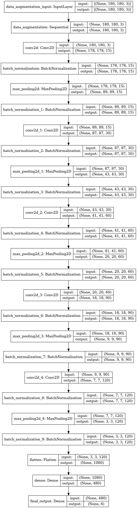

# One-Piece-Image-Classifier

A quick image classifier trained with manually selected One Piece images. 
> 89.53% validation accuracy

## Training 

No pre-trained model has been used. The training session has been runned on Google Colab with a GPU execution type. 

## Notebook 

> Notebook link : [Click here](Model_without_Keras_Tuner.ipynb)

## Model description

- 5 Convolutional layers followed by a batch normalization layer, then a MaxPooling layer followed by a batch normalization layer
- A flatten layer
- A dense layer with 480 units
- An activation layer (sigmoid) which represents the final output: Probability of input(X) belonging to each class
> **Based on Sergey Ioffe and Christian Szegedy "Batch Normalization: Accelerating Deep Network Training by Reducing Internal Covariate Shift" research paper, there is no need to add a dropout layer since we've used a batch normalization layer.**
- Output classes (probabilities) : Brook, Chopper, Franky, Luffy, Nami, Sanji, Zoro

## Architecture

> **Best valdiation accuracy: 89.53%.**

## How to use 

### 1-First option: Using the Tensorflow Serving image deployed [here](https://hub.docker.com/repository/docker/ibrahimserouis/my-tensorflow-models) **TAG: OP_serving**

Pull the Docker imae with the OP_serving tag, then run inferences using the 8501 port. Tightly respect the model input architecture (batch_size, 180, 180, 3). 

> A test script example is available [here](/Scripts/Prediction_OP_Model_Test.py)

### 2-Second option: Google Colab

#### Step 1:  Run all the cells, then upload the files on which you want to make an inference by clicking on the upload button 

#### Step 2: Slide to the prediction results. You will get two messages displayed as shown in the following screenshots: 

> **Represents the probability of the character belonging to each class. These probabilities are mutually non-exclusive, since there can be more than one character within an image**

## Prerequisites

- Python 3.x or higher 
- IDE: Jupyter Lab/Google Colab
- Libraries: Pathlib, Zipfile, os
- Frameworks: Tensorflow 2.0 or higher, Keras
