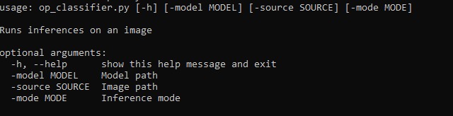
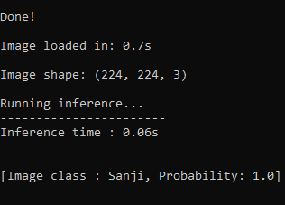

# One-Piece-Image-Classifier    

A quick image classifier trained with manually selected One Piece images. 97.80% validation accuracy.

> **Deployed on my personal Docker Hub repository: [Click here](https://hub.docker.com/repository/docker/ibrahimserouis/my-tensorflow-models)

> **Kaggle Notebook link:  [Kaggle notebook](https://www.kaggle.com/ibrahimserouis99/one-piece-image-classifier-notebook)

> **Tensorflow Lite model : [op_classifier_V14.tflite](https://drive.google.com/file/d/1-xTYqv10IQmV0FS3ftYH6LeTbE86dlkT/view?usp=sharing)

## Training 

A fine-tuned mobilenet has been used. The training session has been runned on Google Colab with a GPU execution type. 

## Notebook 

> Notebook link : [Click here](one-piece-image-classifier-notebook.ipynb)

## Model description

- A data augmentation layer which creates "modified" images of the training set
- A MobileNet layer which detects the features
- A Global average pooling layer which converts the feature vectors into a 1280 element vector
- 1*3 Dense layers followed by a dropout layer to avoid overfitting
- An activation layer (sigmoid) which represents the final output: Probability of input(X) belonging to each class
- Output classes (probabilities) : ['Ace', 'Akainu', 'Brook', 'Chopper', 'Crocodile', 'Franky', 'Jinbei', 'Law', 'Luffy', 'Nami', 'Robin', 'Sanji', 'Shanks', 'Usopp', 'Zoro']

## Architecture

> **Best valdiation accuracy: 97.80%.**

## Results (Amazon SageMaker endpoint)

# Useful scripts 
- [JFIFF to PNG converter](/Scripts/convert_jfif_to_png.py)
- [Image inverter](Scripts/invert_images.py)

## How to use 

### 1-First option: Using the [command line runner](Scripts/op_classifier.py)

#### Args 

> **The image source can be a file path or a URL**

#### Results 

### 2-Second option: Using the Tensorflow Serving image deployed [here](https://hub.docker.com/repository/docker/ibrahimserouis/my-tensorflow-models) (**TAG: OP_serving**)

Pull the Docker image with the OP_serving tag, then run inferences using the 8501 port. 

> A test script example is available [here](/Scripts/Prediction_OP_Model_Test.py)

## Prerequisites

- Python 3.7 or higher 
- IDE: Jupyter Lab/Kaggle Notebooks/Google Colab 
- Frameworks: Tensorflow 2.6 or higher and its dependencies
- Libraries : OpenCV, PIL, NumPy
